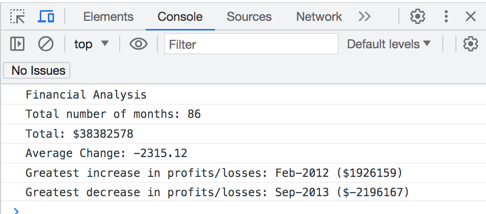

# Console-Finances

# Description
This project uses HTML and JavaScript to display the analysis of a companies financial data in the webpages console. JavaScript code was created to console log the number of months in the data, the net profit, the average change and the greatest increase and decrease in profit or loss over the period. Throughout this project multiple coding skills in JavaScript were developed including how to use for loops to add numbers in an array, how to round to the nearest 100th and how to use the numeric sort function to find the greatest differences in an array.

# Installation
N/A

# Usage
To see what the JavaScript code is doing in this project the console on the webpage needs to be opened. In order to do this, open the webpage, right click on the webpage and open inspect. Once inspect opens on the right side of the web browser go to the top and click console. This will display the results of the console.log codes in the index.js file.

To access the webpage click this link: https://embow24.github.io/Console-Finances/ 

Below is a screenshot of the console displaying the analyasis of the financial data created in the index.js file:

# Credits
Below are a list of websites accessed to support with the understanding of the javaScript code needed to complete this project:

https://developer.mozilla.org/en-US/docs/Web/JavaScript/Reference/Global_Objects/parseInt 
https://www.w3schools.com/jsref/jsref_push.asp        
http://www.javascripter.net/faq/rounding.htm           
https://www.w3schools.com/js/js_array_sort.asp#mark_numeric 

# License
MIT